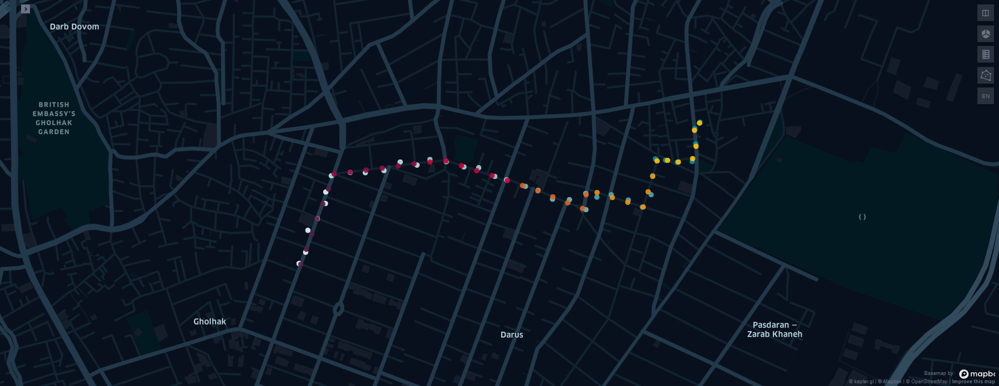
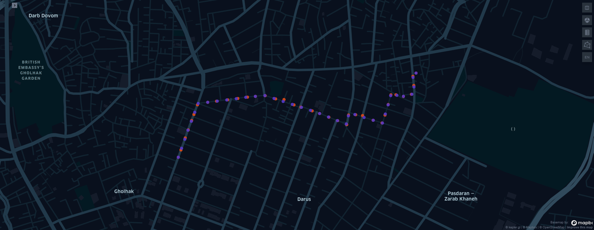

# Overview
This repository contains two phases of the Artificial Intelligence course project. In Phase 1, we will implement a denoising algorithm for GPS noise. The goal of Phase 2 is to design a system that suggests destinations to passengers

---

# Phase 1 : GPS denoising
In many cases, when an application deals with a user's GPS location, especially in urban areas and areas with tall towers, the GPS signal can become too noisy. An interesting fact about noises is that they can be modeled as a hidden Markov model. The hidden variables represent the actual locations, while the observations represent noisy GPS locations. To find the most likely sequence of locations, we can employ the Viterbi algorithm. Briefly, I used the following steps to solve the problem:

1. To determine the actual location, I collect the four nearest street segments to the noisy location. The noisy location is then projected onto these segments to form our state values.
2. Emission probability ($p(o_i|x_i)$): I modeled this probability using a normal distribution. It is a reasonable choice since most noise occurrences have a small domain, and noises with a large radius are uncommon.
3. Transition probability ($p(x_{i+1}|x_i)$): The likelihood of transitioning from $x_i$ to $x_{i+1}$ correlates with the distance between two points in time, i and i+1. Because noises exhibit normal behavior, we anticipate that real locations will be near noisy locations. Therefore, we can model the transition probability using an exponential distribution.

$$p(o_i | s_j) = \frac{1}{\sqrt{2\pi\sigma_{o}}} e^{-0.5\frac{||o_i-x_{i,j}||^2}{\sigma_{o}^2}}$$

$$p(x_{i+1}|x_i) = \frac{1}{\lambda} e^{\frac{-| \ ||x_{i+1} - x_i|| - ||o_{i+1} - o_i|| \ |}{\lambda}}$$

$s_j$ is a street segment and $x_{i,j}$ is the projection of $o_i$ on $s_j$.

After doing previous steps, we are ready to perform viterbi, so the process of training leads to an approximation of these two distributions parameters.

|  |  |
|:--:|:--:|
| *Real and noisy locations* | *Real and denoised locations* |

---

# Phase 2 : Destination Suggestion
In many applications there is a recommender system that suggest destination based on passeneger's history. These recommenders use a set of parameters or features to predict the destination. In this project we engineered these features and implemented such a system with three different algorithm: 1.KNN, 2.XGBoost and 3.Neural Networks. 

| algorithm | train accuracy | test accuracy |
| ----- | ---- | ---- |
| KNN | 0.9149 | 0.4285 |
| XGBoost | 0.9999 | 0.6817 |
| NN | 92.2268 | 90.1311 |

Consequently, NN outperformed the other two algorithms because it is not overfitting and has the highest accuracy on test set.
